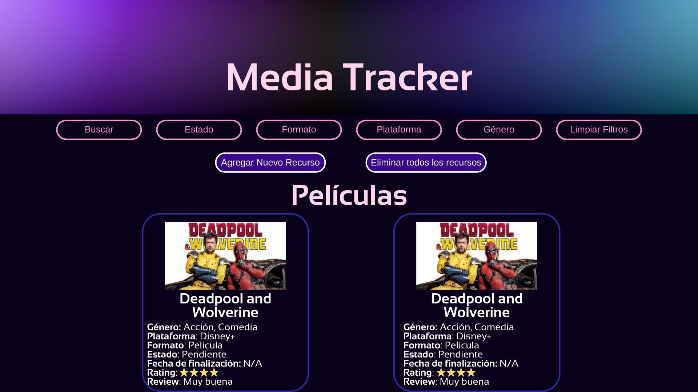
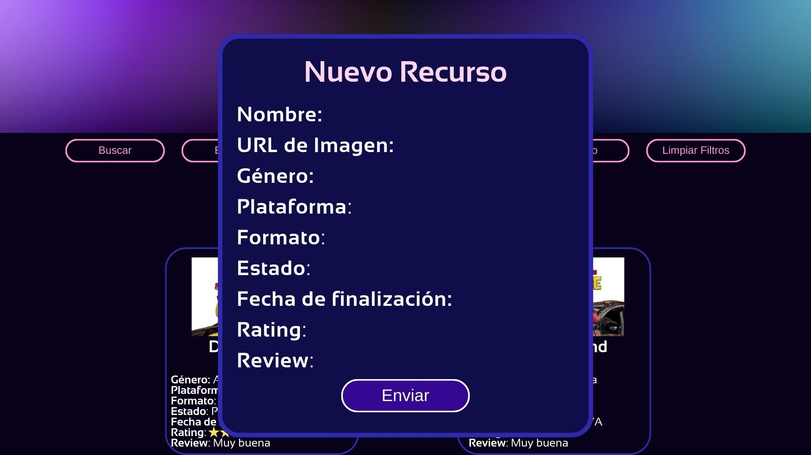
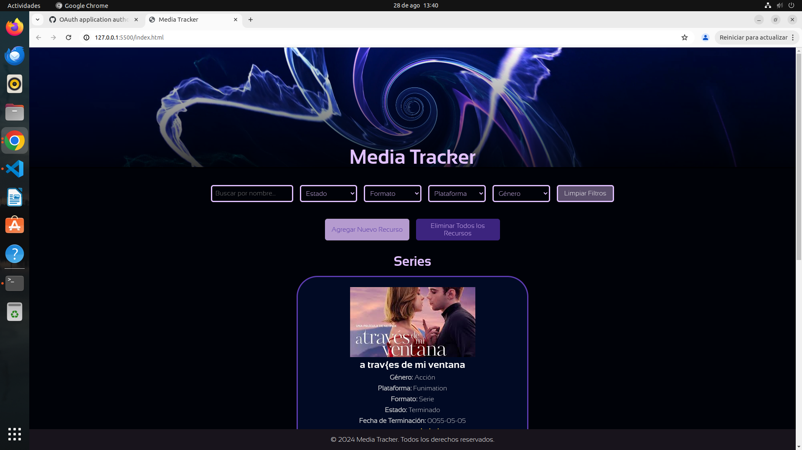
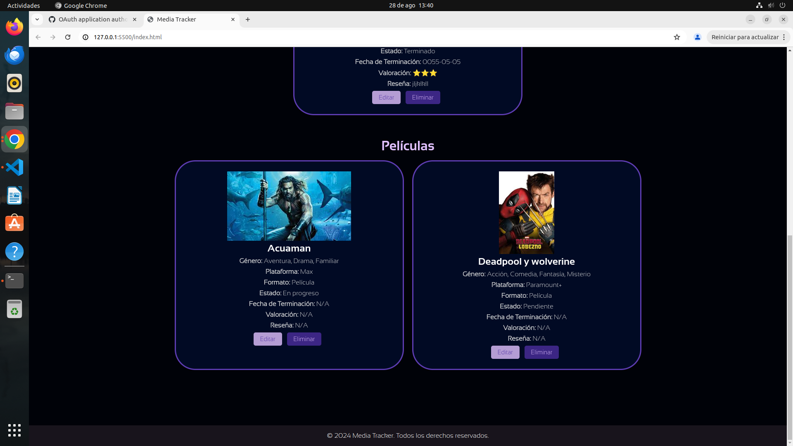
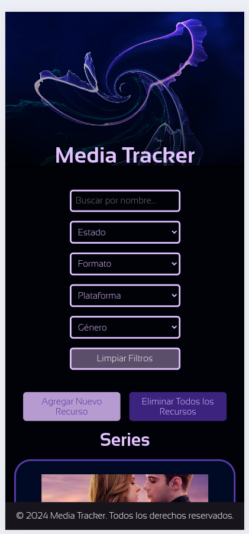
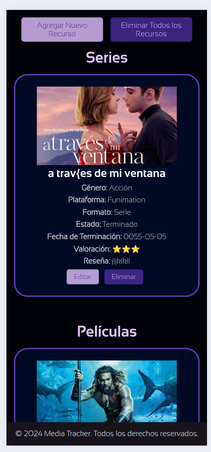
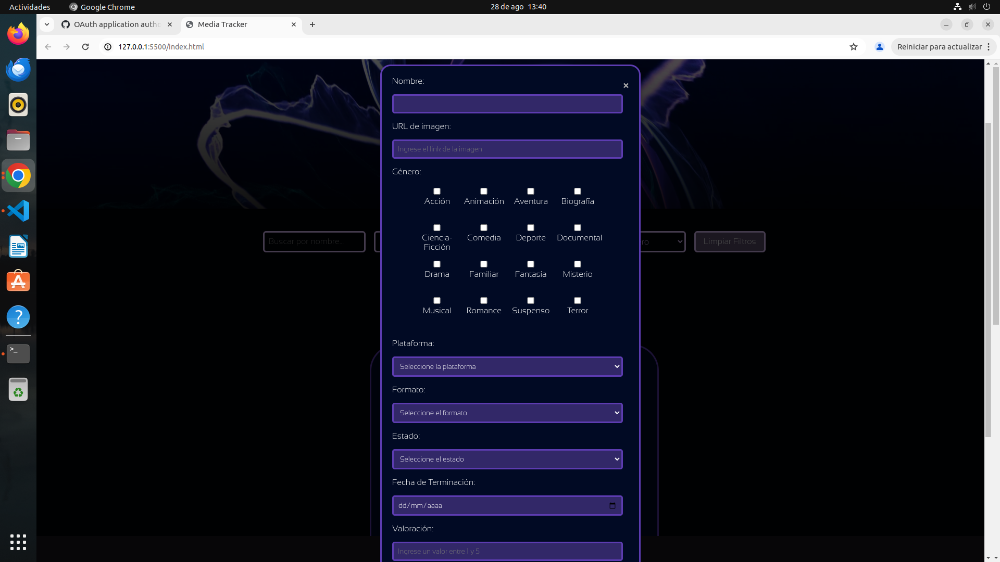
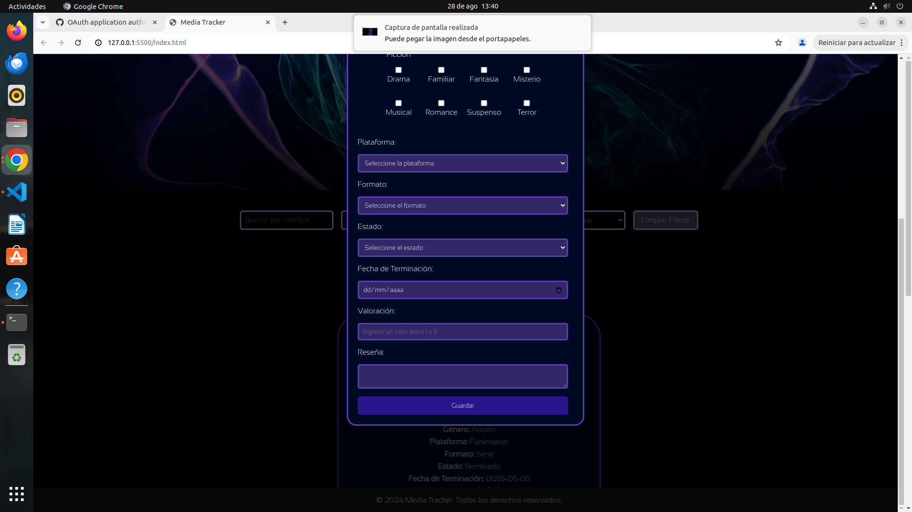
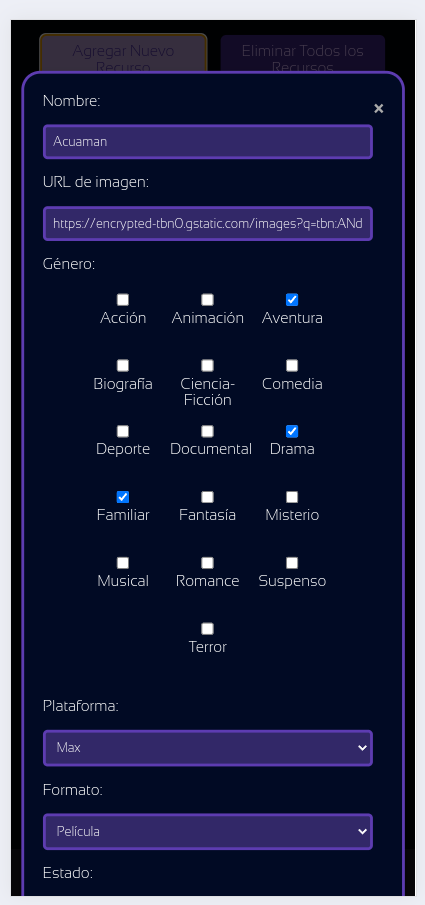
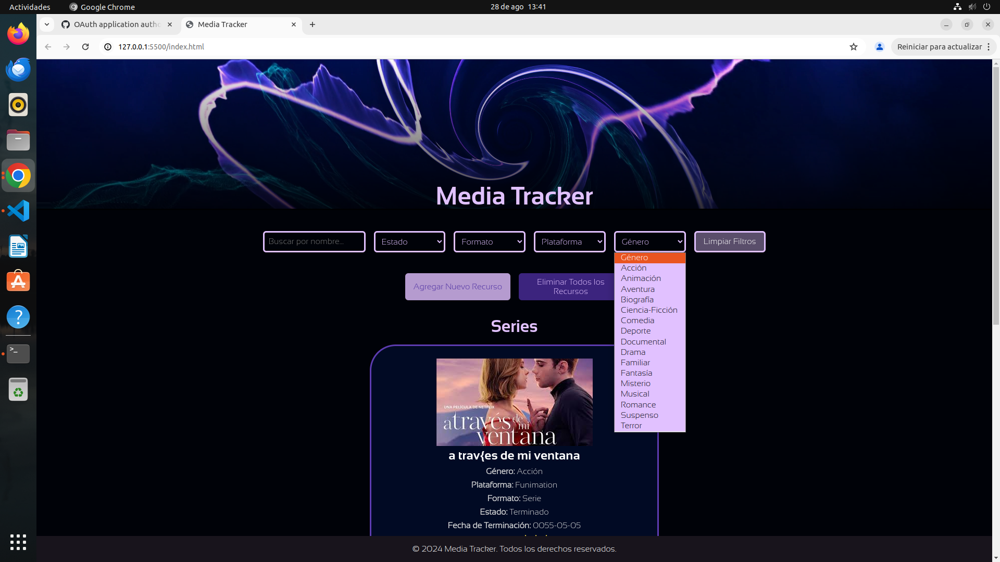

# 📽️ Media Tracker
Bienvenido a Media Tracker 🎬, una aplicación web diseñada para que gestiones y sigas el progreso de las series, películas y libros que consumes. Con Media Tracker podrás organizar tus recursos por formato, estado, plataforma, y género, además de agregar, modificar o eliminar registros de manera sencilla.

El diseño está inspirado en una estética minimalista y moderna, con un enfoque en colores oscuros y neón, junto con un video de fondo para darle un toque dinámico a la experiencia del usuario.

## 🎯 Características Principales
Filtro Dinámico: Filtra recursos por nombre, formato, estado, plataforma o género en tiempo real.
Agregar Recursos: Registra nuevos títulos con información detallada como nombre, URL de imagen, formato, estado, fecha de terminación, valoración y reseña.
Edición y Eliminación: Modifica o elimina recursos fácilmente desde las tarjetas.
Diseño Responsivo: Adaptado a diferentes dispositivos, desde escritorio hasta móviles.

## 🎨 Diseño

El diseño utiliza colores oscuros, violetas y detalles en neón, con tipografías modernas y ligeras. Se combina con un video de fondo en el header para agregar dinamismo visual.

Colores: Fondo negro #000208 con acentos neón en tonos morados y lilas (#e1c1ff, #5d3cb1, #4d2fa2).
Fuentes: Usamos la familia tipográfica Sansation, disponible en versiones Light y Bold.
Responsive Design: Adaptaciones cuidadosas para que la experiencia sea óptima tanto en móviles como en pantallas grandes.

## 🛠️ Instalación
Clonar el repositorio:
bash
Copiar código
git clone https://github.com/tuUsuario/media-tracker.git
Instalar las dependencias necesarias: Si usas alguna herramienta de construcción o paquetes adicionales.
bash
Copiar código
npm install
Abrir el archivo HTML en tu navegador favorito para visualizar la aplicación.

## 🚀 Uso
Agregar un recurso: Haz clic en el botón "Agregar Nuevo Recurso" y completa el formulario emergente.
Aplicar Filtros: Usa los campos de búsqueda y selecciona los filtros por formato, estado, plataforma y género para ajustar la visualización de los recursos.
Edición/Eliminación: Desde las tarjetas de los recursos, puedes editar los detalles o eliminar el recurso de la lista.

## 📁 Estructura del Proyecto
bash
Copiar código
.
├── index.html         # Archivo principal HTML de la aplicación.
├── styles.css         # Estilos CSS personalizados.
├── index.js           # Funcionalidades JS para manejo de la lógica de la aplicación.
├── Fuentes/           # Fuentes usadas en el HTML.
└── resources-media/   # Carpeta con el video utilizado en el header.

## 🖥️ Tecnologías Utilizadas
HTML5: Para la estructura de la página.
CSS3: Para el diseño y la responsividad, incluyendo el video de fondo y la animación de modales.
JavaScript (vanilla): Manejo de eventos como agregar, editar, eliminar y filtrar recursos.

## 🖌️ Estilos Clave en el Diseño
Header: Contiene un video de fondo (headerVideo) que cubre el 100% del ancho de la pantalla y tiene un desvanecimiento hacia negro.
Modal Transparente: Los formularios emergentes tienen un fondo oscuro con transparencia (background-color: rgba(0, 0, 0, 0.7)), lo que permite un enfoque elegante y moderno.
Tarjetas de Recursos: Cada recurso se presenta en una tarjeta con bordes redondeados, sombra suave y detalles en tonos morados.
Animaciones: Los botones y elementos interactivos tienen transiciones suaves para mejorar la experiencia del usuario.

## 🎨 Colores
css
Copiar código
/* Colores principales */
--background-color: #000208;   /* Fondo negro */
--primary-color: #e1c1ff;      /* Color liláceo para acentos */
--secondary-color: #5d3cb1;    /* Morado oscuro */
--highlight-color: #4d2fa2;    /* Neón morado */

## 🖼️ Visualización
A continuación, se muestran algunas capturas de pantalla del funcionamiento y diseño de la página:

### Página Principal

### Modal de Agregar Recurso

### Vista de Recursos Filtrados

## Autor👨‍💻
#### "IMPULSANDO LA INNOVACIÓN Y EL DESARROLLO TECNOLÓGICO"
> Luis Nicolás Méndez
- Email : 		nicolas-mendez@hotmail.com
- LinkedIn : 	https://www.linkedin.com/in/luis-nicol%C3%A1s-m%C3%A9ndez-palacios-935047233/
- GitHub :		https://github.com/nicolasm9808
